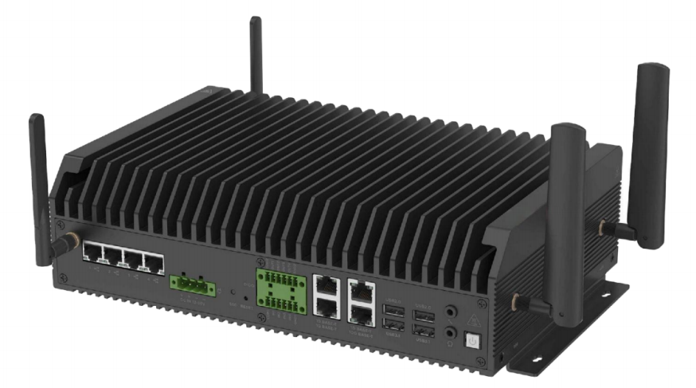
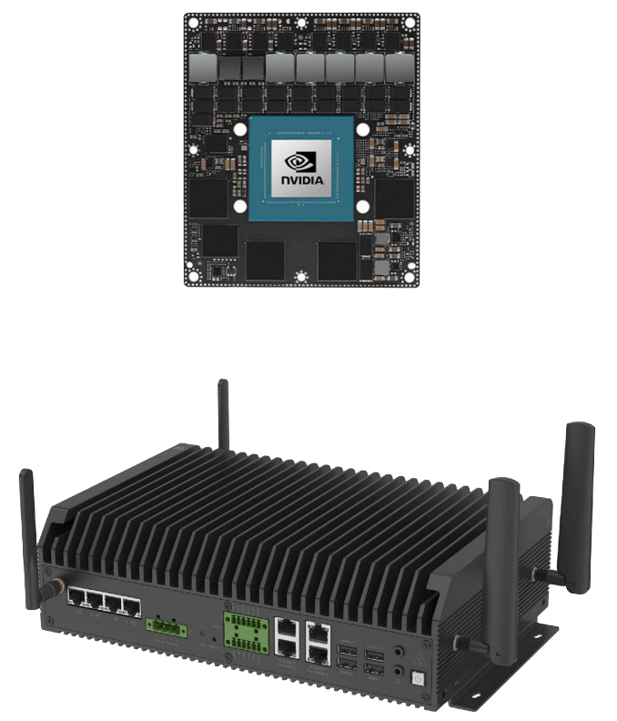

# BPC-EA-600 NVIDIA Jetson Series Edge AI Computing
 

## Overview
The BPC-EA-600 is an industrial-grade embedded system designed for edge AI applications, powered by the NVIDIA Jetson AGX Orin core module from the NVIDIA Jetson Series. Delivering efficient AI processing capabilities, it serves critical domains including Intelligent transportation, vehicle-road collaboration, Logistics monitoring, smart security.

## Specification
| System          |                 |
|-----------------|-----------------|
| CPU             | NVIDIA Jetson AGX Orin Module, 8-core ARM Cortex A78AE 64-bit CPU 2MB L2 + 4MB L3. The PWR consumption is 15W/40W. |
| Memory          | Onboard 32GB LPDDR5 |
| Storage         | Onboard 64GB eMMC |
| OS              | Linux OS |
|**Communication**|               
| Ethernet | 1 x 10GBE (10000/1000 Base-T) 2 x GBE (1000/100/10 Base-T)(optional) |
|**Display & Audio**|
| Display | 1 x HDMI output |
| Audio | 1 x MIC IN + 1 x Line OUT|
|**I/O**|  
|  | 2 x USB2.0 2 x RS232/485/422 (DB9) 2 x CAN (DB9) |
|**Expansion**|
|  | 1 x M.2 M-Key 2280 NVME 2 x 2.5" SATA Bay 4 x Antenna 2 x MiniPCIe for GMSL (4 in 1) expansion card |
|**Power Supply**|
| Power Input | DC 12~36V |
|**Mechanical & Environmental**|
| Enclosure Material | Steel and aluminum alloy |
| Dimension   | 226mm(W) x 70mm(H) x 144mm(D) (±0.5mm) |
| Operating Temp. | -20°C to +80°C (60~80°C slowdown) |
| Storage Temp. | -40℃ to +80℃ |

## Safety Instructions:
***To aviod malfunction or damage to this product please observe the following:*** 
- Disconnect the device from the DC power supply before cleaning. Use a rag. Do not use liquid 
detergents or spray-on detergents.
- Keep the device away from moisture.
- During installation, put the device on a reliable table. It will be damaged if you drop it.
- Before connecting the power supply, ensure that the voltage is in the required range.
- Put the power cable in place to avoid stepping on it
- If the device is not used for a long time, power it off to avoid damage caused by sudden overvoltage.
- Do not pour liquid into the hold of the enclosure, as this could cause fire or electrocution.
- For safety reasons, the device can only be disassembled by professional personnel.
- Do not place the device outside the specified ambient temperature range. This will damage the machine. It needs to be kept in an environment at controlled temperature.

## Contact Us
- **Headquarters**: DEBIX Technology Inc., 8345 Gold River Ct., Las Vegas, NV 89113, USA  
- **Factory**: 5-6/F., East Zone, Shunheda A2 Building, Liqxiandong Industrial Park, XiLi, Nanshan Dist., Shenzhen, China 
- **Email**: info@debix.io  
- **Website**: [www.debix.io](https://www.debix.io)  
- **Community**: [Discord](https://discord.com/invite/adaHHaDkH2)

